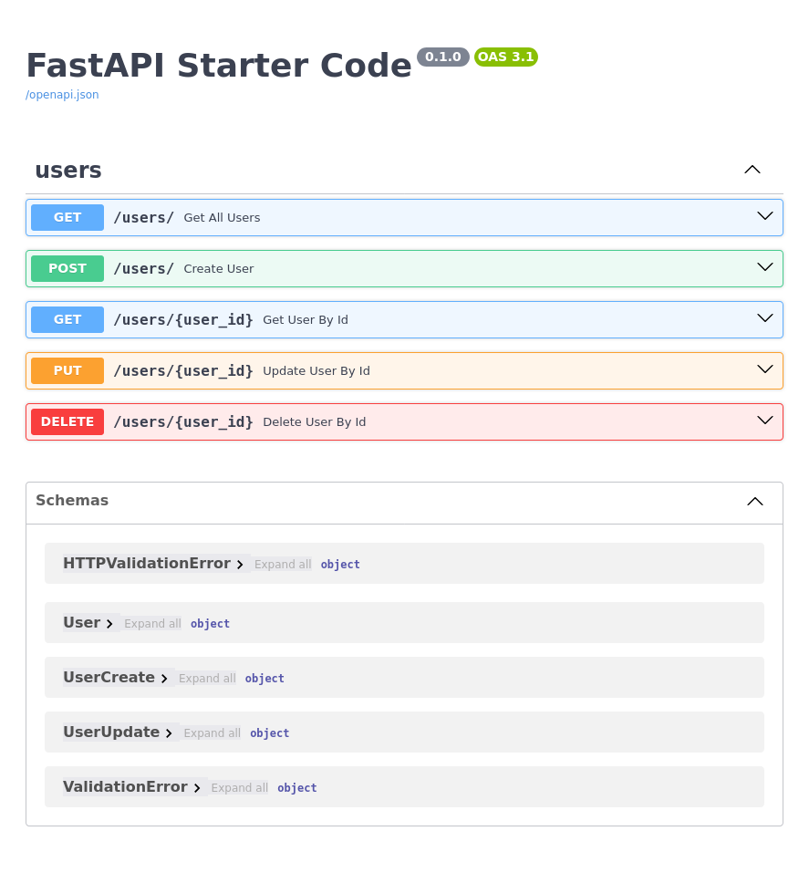

# FastAPI Starter Code

This starter code builds to be have lees code possible to get started with FastAPI project. while offering a robust and nice structure project ✨🔥

## Feature

- ⚡ [FastAPI](https://fastapi.tiangolo.com) A fast and asynchronous framework for building APIs.
- 🧰 [SQLModel](https://sqlmodel.tiangolo.com) Provides Python SQL database interactions (ORM), recommended by FastAPI.
- 💾 [PostgreSQL](https://www.postgresql.org) SQL database.
- 💼 [Adminer](https://www.adminer.org/) Database management tool, offering a user-friendly web interface for interacting with your database.
- 🚀 **Development Environment**: Simplified development setup and process using **Docker compose**.

this starter code includes an example of CRUD operations for Users, complete with modules, routes, and error handling 😇.

